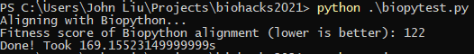
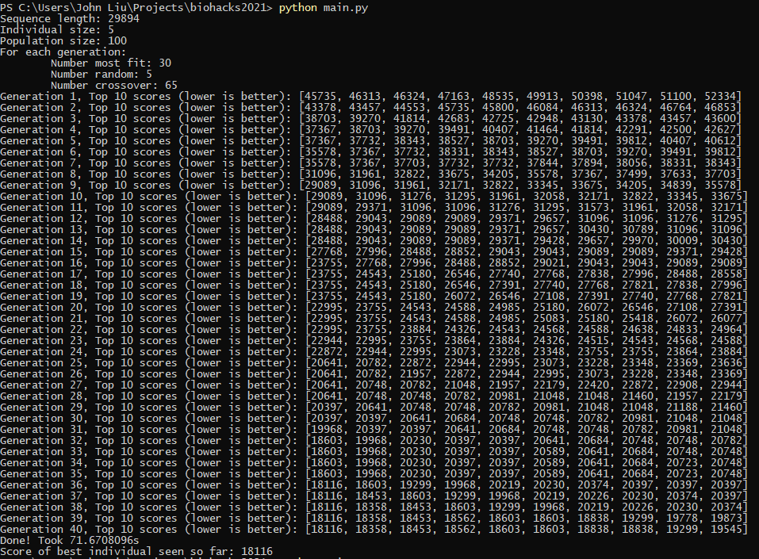
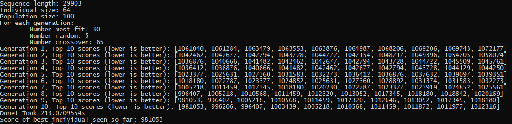

# BioHacks 2021

This is our BCBSU BioHacks 2021 submission. Authors: Tiantian Li, John Liu.

# Introduction

Multiple sequence alignment (MSA) refers to the [sequential alignment of three or more biological sequences, generally protein, DNA, or RNA](https://en.wikipedia.org/wiki/Multiple_sequence_alignment). The problem is quite simple to understand, given some set of n sequences, we wish to transform these sequences into some set of n' sequences, such that all the n' sequences are of the same length, by inserting gaps into the sequence. We want to do this while minimizing two primary targets:

1. differences between all pairs of sequences
2. minimizing the number of gaps inserted

The biggest problem with MSA is that, [even a naive dynamic programming approach is an NP-complete problem](https://www.liebertpub.com/doi/10.1089/cmb.1994.1.337); that means that its very difficult to compute!

There are of course, numerous optimizations and clever heuristics that can significantly improve our runtimes, but even then, to get a quality result, takes significant time.

# GA-MSA

The Genetic Algorithm-Multiple Sequence Alignment (GA-MSA) is a new approach to MSA using a Genetic Algorithm (GA).

# Try it out

Requirements and Dependences:
  - python3.x, we use 3.8 and have no problems
  - If trying to find a baseline to compare to: [Biopython](https://biopython.org/) and [MuscleCommandLine](http://www.drive5.com/muscle/)

We provide three FASTA samples of length 2, 5, and 64. Do not use 64, it will take too long. By default, both our GA-MSA and use the sample with 5 sequences to perform MSA on.

These samples are of SARS-CoV-2 which we got from the [NLM](https://www.ncbi.nlm.nih.gov/sars-cov-2/).

In main.py, use the seq_file to select which sample to use, (warning, 64 can take very long!). Then run: `python main.py` The results of each generation and the score of each individual (which is the list of sequences to perform MSA on) can be seen. 

To see how that compares to a real industry level MSA algorithm, run `python biopytest.py`.

# How does it work?

GA-MSA employs a genetic algorithm. We begin by defining some terminology.

- **Gene**: a single sequence in a list of sequences that we wish to align
- **Individual**: the list of sequences that we wish to align
- **Population**: a group of individuals, each with different genes
- **Generation**: an instance of a population

We begin with generation 1. We take the list of sequences we wish to align and simply generate random gaps to fill them all. An individual consists of those current sequences, where all of them share the same length. Multiple individuals are produced to make a population.

The iterative portion begins now. We compute a fitness score for each individual. In our case, we count the number of differences between the sequences, therefore, the lower the fitness score the better. We take the strongest individuals, cross breed them by interwining genes, and this produces the next generation.

We continue doing for a specified number of generations. The idea is that hopefully, at the end, we have converged onto an optimal solution.

# Results

These results were done on a machine with an i9-10850k. The output of our fitness function is the number of differences between the sequences. The lower the number, the better.

With Biopython and MUSCLE's aligning algorithms, we get an incredible score of 122 on input_5_items.fasta that takes about 170-175 seconds to compute.

With GA-MSA and a population size of 100 and 40 generations, the lowest score we can achieve is 18116, and this is done in about 70 seconds.

The bad news: GA-MSA is absolutely terrible.
The good news: GA-MSA lacks any good heuristics and optimizations at the moment. This is a very basic MSA algorithm. But, there is even more potential then that. Try running input_64_items.fasta with Biopython. Your computer will run out of memory before it finishes, and the universe will probably have exploded anyway even if you had enough memory. Run GA-MSA with input_64_items.fasta, and you will at least get an answer (albeit also likely terrible) within a 5 minutes (a score of 981053 in 213s in one test).

MSA is an NP-complete problem; in short, it means that its finding the (or an) optimal solution is extremely computationally expensive. The goal of GA-MSA is to develop a very cheap algorithm that runs much quicker, at the cost of solution quality.

# Images

## Biopython and MUSCLE MSA on 5 items

An impressive score of 122 in less than 3 minutes on an i9-10850k.

## Biopython and MUSCLE MSA on 64 items

Your computer will crash. This is computationally infeasible.

## GA-MSA on 5 items

This yields a score of 18116 (and this will differ from run to run of course). Quite the difference from 122.

This yields a score of 981053. There is no baseline to this number to, but we imagine Biopython and MUSCLE would produce something much better than this (if it would ever finish computation).

